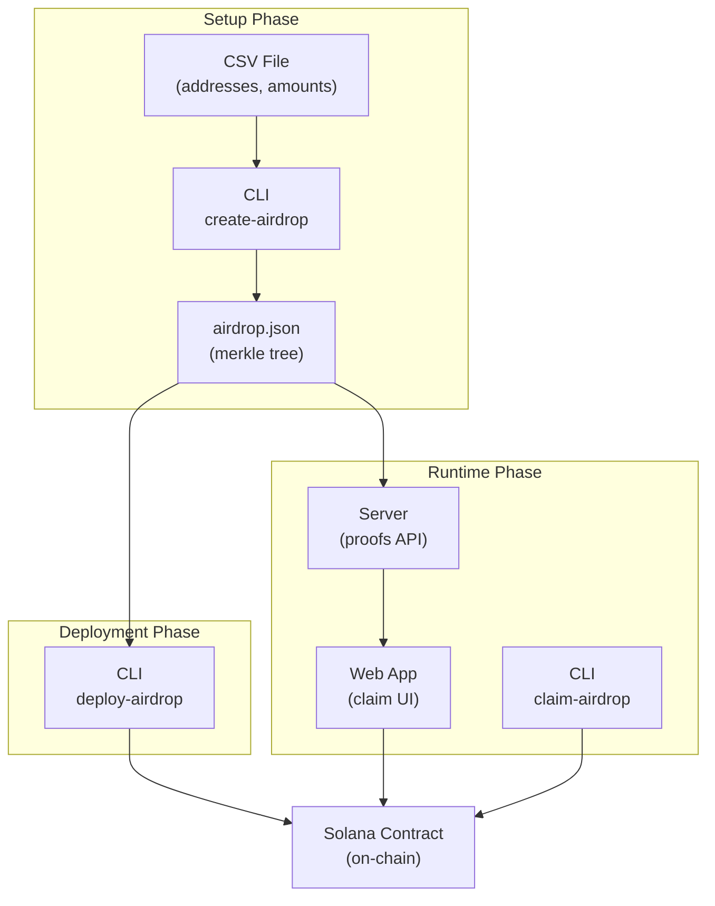

# Solana Easy Airdrop

A merkle tree-based token airdrop system for Solana. Create airdrops from a CSV file, deploy on-chain, and allow users to claim their tokens with cryptographic proofs.

## Why Solana Easy Airdrop?

- **Clean, beautiful claim interface**: A polished user experience for airdrop claiming on Solana
- **Minimal frontend requirements**: All data is stored server-side; the frontend fetches only what it needs for each claim
- **Flexible merkle root switching**: Easily claim from different airdrops by changing the merkle root, no reinitialization required
- **Shared program deployment**: A single deployed program can be reused by anyone creating new merkle roots, making it extremely cost-efficient
- **Simple integration**: Minimal boilerplate to integrate airdrop claiming into any Solana application

## Architecture



## Components

| Directory | Description |
|-----------|-------------|
| `cli/` | Rust CLI for merkle tree generation and on-chain deployment |
| `airdrop-contract/` | Anchor smart contract for on-chain airdrop management |
| `server/` | Express server that serves merkle proofs to claimants |
| `web/` | React frontend for claiming airdrops |
| `sdk/` | React hooks package (`@solana-easy-airdrop/react`) for integration |

## Prerequisites

- [Rust](https://rustup.rs/) (for CLI and contract)
- [Solana CLI](https://docs.solana.com/cli/install-solana-cli-tools) (v1.18+)
- [Anchor](https://www.anchor-lang.com/docs/installation) (v0.31+)
- [Node.js](https://nodejs.org/) (v18+)
- [Bun](https://bun.sh/) (for server)
- [pnpm](https://pnpm.io/) (for web and sdk)

## Rust Toolchain Setup

This project requires two different Rust toolchains due to Solana/Anchor constraints:

1. **`solana` toolchain** (rustc 1.84+) - Used by the CLI for `anchor-client` and `solana-sdk` dependencies
2. **Rust 1.79.0** - Used by Anchor for building the on-chain program (BPF compilation)

### Why Two Toolchains?

- The CLI uses `anchor-client` to interact with the deployed program, which depends on `solana-sdk` 2.x
- `solana-sdk` 2.x requires Rust 1.83+
- Anchor's BPF compiler (`cargo-build-sbf`) requires Rust 1.79.0
- These can't use the same toolchain, so each directory has its own `rust-toolchain.toml`

### Toolchain Files

| File | Toolchain | Purpose |
|------|-----------|---------|
| `/rust-toolchain.toml` | `solana` | CLI builds (solana-sdk 2.x compatible) |
| `/airdrop-contract/rust-toolchain.toml` | `1.79.0` | Anchor/BPF builds |

### Installing the Solana Toolchain

The `solana` toolchain is installed automatically when you install Anchor/Solana CLI tools. Verify with:

```bash
rustup run solana rustc --version  # Should show 1.84.x
```

### IDE Setup (VS Code)

rust-analyzer may have issues with the `solana` toolchain's proc-macro server. The `.vscode/settings.json` configures rust-analyzer to use the `stable` toolchain for analysis while builds still use the correct toolchain:

```json
{
    "rust-analyzer.server.extraEnv": {
        "RUSTUP_TOOLCHAIN": "stable"
    }
}
```

This means IDE features (autocomplete, error checking) use `stable`, but `cargo build` respects `rust-toolchain.toml`.

## Quick Start

### 1. Generate Merkle Tree from CSV

Create a CSV file with `address,amount` format:

```csv
address,amount
FEHVBLQa7gYKdVT3jc2NQviSs3EgzTyD3k2yyPm5pTXP,100
31HrWnNNM3QvZYNqN2F1CqWE2iiYfCV1pvLvTeZwyHBS,20
7N3h2Zp4i9DzRbRGjtJHnRXnUbjKxLpsCnxmz7RLS1qZ,30
```

Run the CLI to generate the merkle tree:

```bash
cargo run -- create-airdrop --input ./airdrop.csv
```

This creates `airdrop.json` containing:
- `merkle_root`: The 32-byte root hash (as 64-char hex string)
- `merkle_tree`: Full tree for proof generation (array of hex strings)
- `claims`: Mapping of addresses to amounts and leaf indices

Example output:
```json
{
  "merkle_root": "88ee7ea2477c74b54593c5ca51d64c7b1a32b359...",
  "merkle_tree": ["0000000000...", "88ee7ea247...", ...],
  "claims": {
    "FEHVBLQa7gYKdVT3jc2NQviSs5EgzTyD3k2yyPm5pTXP": {
      "amount": "100",
      "leaf_index": 8
    }
  }
}

### 2. Deploy the Contract

Start a local Solana validator:

```bash
solana-test-validator
```

In another terminal, build and deploy the contract:

```bash
cd airdrop-contract
anchor build
anchor deploy
```

Note the program ID from the deployment output. It should match the ID in `Anchor.toml`:
```
F6fHBUyYyaW14CxjSnJjLck8vMmWew3PbCnt5TMqRdZX
```

### 3. Deploy the Airdrop On-Chain

Use the CLI to deploy the airdrop. This will create a new token mint and initialize the airdrop:

```bash
cargo run -- deploy-airdrop --json ./airdrop.json --network localnet
```

The command will output:
- The new mint address (if not provided)
- The merkle root PDA
- Transaction signature with explorer link

#### Deploy Options

```bash
# Deploy to localnet with auto-created mint
cargo run -- deploy-airdrop --json ./airdrop.json --network localnet

# Deploy to devnet (default network)
cargo run -- deploy-airdrop --json ./airdrop.json

# Deploy with an existing mint
cargo run -- deploy-airdrop --json ./airdrop.json --mint <MINT_ADDRESS>

# Use custom keypair and program ID
cargo run -- deploy-airdrop --json ./airdrop.json \
  --keypair ~/.config/solana/my-keypair.json \
  --program-id <PROGRAM_ID>
```

The total token amount is automatically calculated from the claims in `airdrop.json`.

### 4. Set Up the Server

Copy the generated `airdrop.json` to the server:

```bash
cp airdrop.json server/airdrop_jsons/
```

Install dependencies and start the server:

```bash
cd server
bun install
bun run start
```

The server runs on `http://localhost:5000` and exposes:
- `GET /api/airdrop/:rootHex/:address` - Returns claim data and merkle proof

### 5. Set Up the Web App

Configure environment:

```bash
cd web
cp .env.example .env
```

Edit `.env` if needed:
```
VITE_AIRDROP_SERVER_URL=http://localhost:5000
```

Install dependencies and start:

```bash
pnpm install
pnpm dev
```

The web app runs on `http://localhost:5173`.

## CLI Reference

### `create-airdrop`

Generate a merkle tree from a CSV file.

```bash
cargo run -- create-airdrop --input <CSV_FILE>
```

**Input:** CSV file with `address,amount` columns
**Output:** `airdrop.json` file

### `deploy-airdrop`

Deploy an airdrop on-chain.

```bash
cargo run -- deploy-airdrop --json <JSON_FILE> [OPTIONS]
```

**Options:**
| Option | Description | Default |
|--------|-------------|---------|
| `--json <FILE>` | Path to airdrop.json (required) | - |
| `--mint <ADDRESS>` | Existing token mint address | Creates new mint |
| `--network <NETWORK>` | Network: localnet, devnet, testnet, mainnet | devnet |
| `--program-id <ID>` | Airdrop program ID | From Anchor.toml |
| `--keypair <PATH>` | Keypair file path | ~/.config/solana/id.json |

### `claim-airdrop`

Claim tokens from an airdrop.

```bash
cargo run -- claim-airdrop --json <JSON_FILE> [OPTIONS]
```

**Options:**
| Option | Description | Default |
|--------|-------------|---------|
| `--json <FILE>` | Path to airdrop.json (required) | - |
| `--mint <ADDRESS>` | Token mint address | Reads from airdrop.json |
| `--address <ADDRESS>` | Address to claim for | Keypair's address |
| `--network <NETWORK>` | Network: localnet, devnet, testnet, mainnet | devnet |
| `--program-id <ID>` | Airdrop program ID | From Anchor.toml |
| `--keypair <PATH>` | Keypair file path | ~/.config/solana/id.json |

## Usage

### Claiming an Airdrop (Web App)

1. Connect your wallet (must be an address in the original CSV)
2. Enter the merkle root for the airdrop
3. Click "Claim Airdrop"

The app will:
- Fetch your proof from the server
- Submit the claim transaction with the proof
- Transfer your allocated tokens

### Using the SDK

The `@solana-easy-airdrop/react` package provides hooks for integration:

```tsx
import { AirdropProgramProvider, useClaimAirdrop } from '@solana-easy-airdrop/react';

function App() {
  return (
    <AirdropProgramProvider>
      <ClaimButton />
    </AirdropProgramProvider>
  );
}

function ClaimButton() {
  const claimAirdrop = useClaimAirdrop();

  const handleClaim = async () => {
    const { signature } = await claimAirdrop(merkleRoot, mintAddress);
    console.log('Claimed!', signature);
  };

  return <button onClick={handleClaim}>Claim</button>;
}
```

#### Using a Custom Program ID

If you've deployed your own instance of the contract, pass the `programId` prop:

```tsx
<AirdropProgramProvider programId="YourProgramIdHere...">
  <ClaimButton />
</AirdropProgramProvider>
```

## Development

### Running Tests

CLI tests:
```bash
cargo test
```

Contract tests:
```bash
cd airdrop-contract
anchor test
```

### Project Structure

```
solana-easy-airdrop/
├── Cargo.toml               # Workspace root
├── rust-toolchain.toml      # Solana toolchain for CLI
├── cli/
│   ├── Cargo.toml
│   ├── rust-toolchain.toml  # (inherits from root)
│   └── src/
│       ├── main.rs
│       └── instructions/
│           ├── create_airdrop.rs   # Merkle tree generation
│           ├── deploy_airdrop.rs   # On-chain deployment
│           └── claim_airdrop.rs    # Token claiming
├── airdrop-contract/
│   ├── Cargo.toml           # Anchor workspace
│   ├── rust-toolchain.toml  # Rust 1.79.0 for BPF
│   └── programs/
│       └── airdrop-contract/
│           └── src/
│               ├── lib.rs
│               ├── instructions/   # create_airdrop, claim
│               ├── state/          # MerkleRoot, ClaimReceipt
│               └── errors.rs
├── server/
│   ├── server.ts            # Express API
│   ├── airdrop.ts           # Proof generation
│   └── airdrop_jsons/       # Store airdrop JSON files
├── sdk/
│   └── src/
│       ├── index.ts
│       ├── AirdropProgramProvider.tsx
│       ├── AirdropProgramContext.ts
│       ├── useAirdropProgram.ts
│       ├── useCreateAirdrop.ts
│       ├── useClaimAirdrop.ts
│       └── types.ts
└── web/
    └── src/
        └── App.tsx
```

## How It Works

### Merkle Tree Construction

1. Each leaf is `hash(address || amount)` where amount is u64 little-endian
2. Tree is padded to the next power of 2 with zero hashes
3. Parent nodes are `hash(left || right)`
4. Root is stored on-chain; full tree is stored on server

### Claim Verification

1. User provides `(proof, amount, leaf_index)`
2. Contract reconstructs leaf: `hash(signer_address || amount)`
3. Walks up the tree using proof siblings
4. Verifies computed root matches stored root
5. If valid, transfers tokens and creates receipt (prevents double-claim)

## Design Decisions

### Merkle Tree Storage Efficiency

We store the **full merkle tree** in `airdrop.json` rather than pre-computed proofs for each address. This significantly reduces storage requirements.

**Space Complexity:**

| Approach | Storage | Formula |
|----------|---------|---------|
| Full tree | O(n) | `2n × 32 bytes` |
| Pre-computed proofs | O(n log n) | `n × log₂(n) × 32 bytes` |

The full tree is more efficient both asymptotically and in practice:

**Real-world comparison (32 bytes per hash):**

| Recipients | Full Tree | Pre-computed Proofs | Winner |
|------------|-----------|---------------------|--------|
| 1,000 | 64 KB | 320 KB | Tree (5x smaller) |
| 10,000 | 640 KB | 4.2 MB | Tree (6.5x smaller) |
| 100,000 | 6.4 MB | 53 MB | Tree (8x smaller) |
| 1,000,000 | 64 MB | 640 MB | Tree (10x smaller) |

The full tree approach also enables **on-demand proof generation**—proofs are computed only when requested, reducing server memory usage and allowing efficient streaming from disk.

## Configuration

### Contract (Anchor.toml)

```toml
[programs.localnet]
airdrop_contract = "F6fHBUyYyaW14CxjSnJjLck8vMmWew3PbCnt5TMqRdZX"

[provider]
cluster = "localnet"  # or "devnet"
wallet = "~/.config/solana/id.json"
```

### Web (.env)

```
VITE_AIRDROP_SERVER_URL=http://localhost:5000
```

## License

MIT
